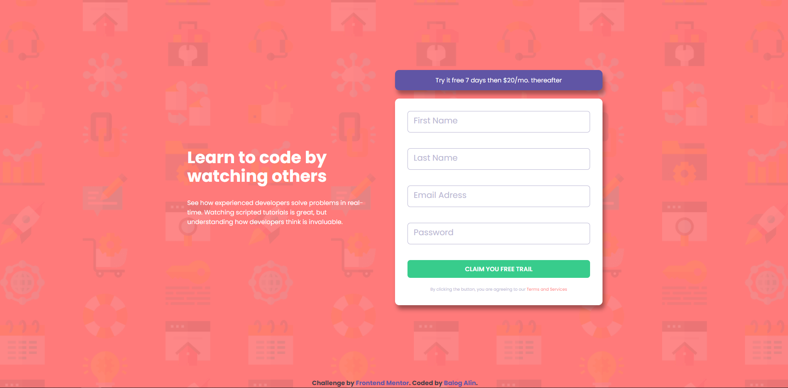

# Frontend Mentor - Intro component with sign-up form

This is a solution to the [Intro component with sign-up form](hhttps://www.frontendmentor.io/challenges/intro-component-with-signup-form-5cf91bd49edda32581d28fd1). Frontend Mentor challenges help you improve your coding skills by building realistic projects.

## Table of contents

- [Overview](#overview)
  - [Screenshot](#screenshot)
  - [Links](#links)
- [My process](#my-process)
  - [Built with](#built-with)
  - [What I learned](#what-i-learned)
  - [Continued development](#continued-development)
- [Author](#author)

## Overview

### Screenshot

### Links

- Solution URL: [github](https://github.com/Fabzus/Intro-component-with-sign-up-form)
- Live Site URL: [github](https://fabzus.github.io/Intro-component-with-sign-up-form/)

## My process

### Built with

- Semantic HTML5 markup
- CSS custom properties
- Flexbox
- Mobile-first workflow
- Javascript
- Regex
- Scss

### What I learned

This was the first time ever i tried scss, it's very fast and powerful yet i need some practice.

### Continued development

I'll admit that i Hard coded some elements when a pattern is clear. I would like to understant .map better

## Author

- Balog Alin
- linkedIn - [@alinbalog](https://www.linkedin.com/in/alinbalog/)
- github - [@Fabzus](https://github.com/Fabzus)
- Frontend Mentor - [@Fabzus](https://www.frontendmentor.io/profile/Fabzus)
